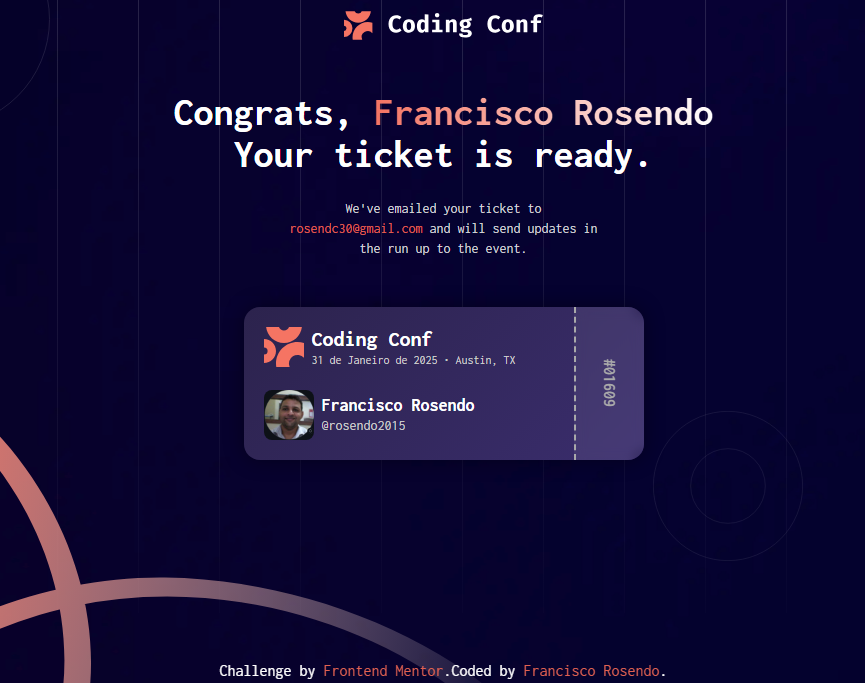

# Frontend Mentor - Solução para o gerador de ingressos de conferência

Esta é uma solução para o [desafio Conference ticket generator no Frontend Mentor](https://www.frontendmentor.io/challenges/conference-ticket-generator-oq5gFIU12w). Os desafios do Frontend Mentor ajudam você a melhorar suas habilidades de programação construindo projetos realistas.

## Índice

- [Visão geral](#overview)
  - [O desafio](#the-challenge)
  - [Captura de tela](#screenshot)
  - [Links](#links)
- [Meu processo](#my-process)
  - [Construído com](#built-with)
- [Autor](#author)

## 🧾 Visão Geral
O Gerador de Tickets de Conferência é uma aplicação interativa desenvolvida como parte de um desafio do Frontend Mentor. Seu objetivo é simular a experiência de inscrição em um evento, permitindo que os usuários preencham um formulário com seus dados e recebam um ticket personalizado ao final.
Este projeto foca em acessibilidade, responsividade e validação de formulários, proporcionando uma experiência fluida e inclusiva para todos os usuários, independentemente do dispositivo ou método de navegação utilizado.
✨ Funcionalidades principais
- Preenchimento de formulário com nome, e-mail e upload de avatar
- Validação em tempo real com mensagens de erro claras e acessíveis
- Navegação 100% via teclado, com suporte a leitores de tela
- Geração dinâmica de ticket após envio bem-sucedido
- Layout responsivo adaptado para diferentes tamanhos de tela
- Feedback visual em estados de foco e hover nos elementos interativos
🎯 Objetivo do projeto
O desafio visa aprimorar habilidades práticas em desenvolvimento front-end, com foco em:
- Boas práticas de HTML semântico e CSS moderno
- Criação de componentes reutilizáveis com React e Styled Components
- Implementação de acessibilidade (A11y) e usabilidade
- Adaptação de interfaces para dispositivos móveis (mobile-first

### O desafio

Os usuários devem ser capazes de:

- Preencher o formulário com seus dados ✅
- Receber mensagens de validação do formulário se:
  - Algum campo estiver em branco ✅
  - O endereço de e-mail estiver formatado incorretamente ✅
  - O upload do avatar for muito grande ou estiver em formato de imagem inválido ✅
- Preencher o formulário usando apenas o teclado ✅
- Ter os campos, dicas e mensagens de erro anunciados pelo leitor de tela ✅
- Ver o ingresso gerado da conferência após enviar o formulário com sucesso ✅
- Visualizar o layout ideal da interface dependendo do tamanho da tela do dispositivo ✅
- Ver os estados de foco e hover para todos os elementos interativos da página ✅

### Captura de tela
## Formulário

## Ticket

### Links

- URL da solução: [github.com/ticket-generator](https://github.com/rosendo2015/ticket-generator)
- URL do site ao vivo: [ticket-generator.vercel.app](https://ticket-generator-eight-ebon.vercel.app/)

## Meu processo

### Construído com

- Marcação HTML5 semântica
- Propriedades personalizadas CSS
- Flexbox
- CSS Grid
- Fluxo de trabalho mobile-first
- [React](https://reactjs.org/) - biblioteca JS
- [Next.js](https://nextjs.org/) - framework React
- [Styled Components](https://styled-components.com/) - para estilos

## Autor

- Frontend Mentor - [@rosendo2015](https://www.frontendmentor.io/profile/rosendo2015)
- Twitter - [@Rosendo92671729](https://x.com/Rosendo92671729)
- Linkedin - [@Rosendo92671729](https://www.linkedin.com/in/francisco-rosendo-coelho/)